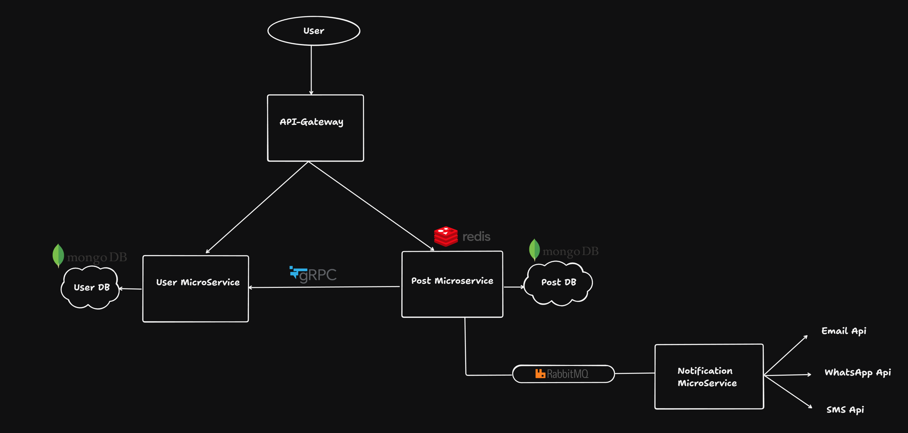
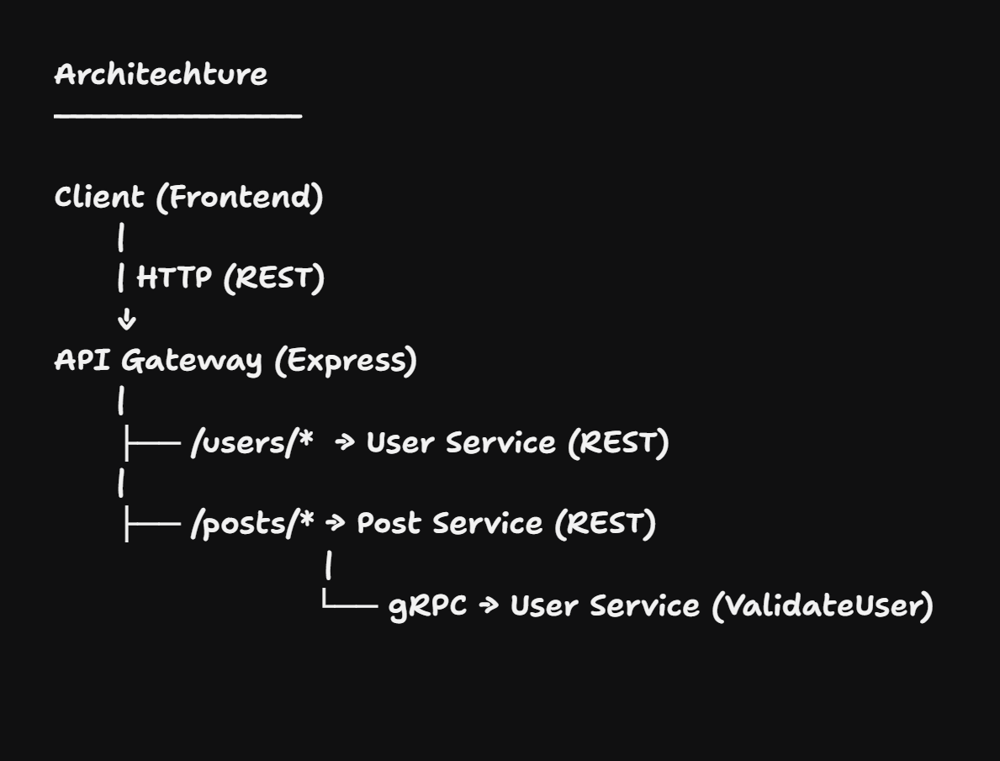

# HLD

## LLD

Architechture
----------------

Client (Frontend)
      |
      | HTTP (REST)
      ↓
API Gateway (Express)
      |
      ├── /users/*  → User Service (REST) 
      |
      ├── /posts/* → Post Service (REST)
                          | 
                         └── gRPC → User Service (ValidateUser) 
        
      

